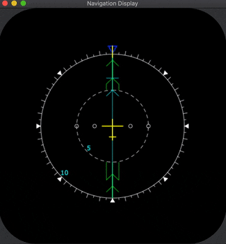
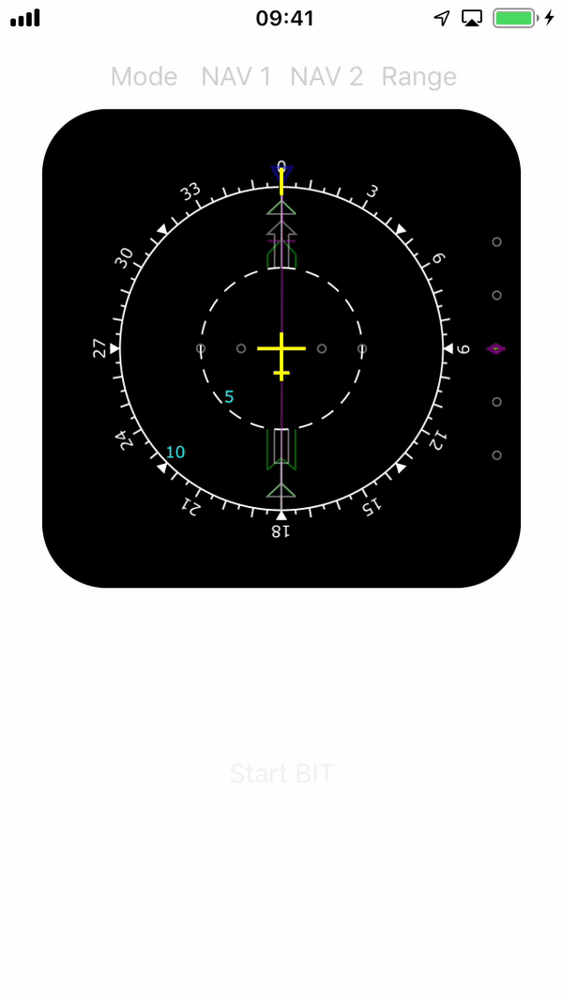
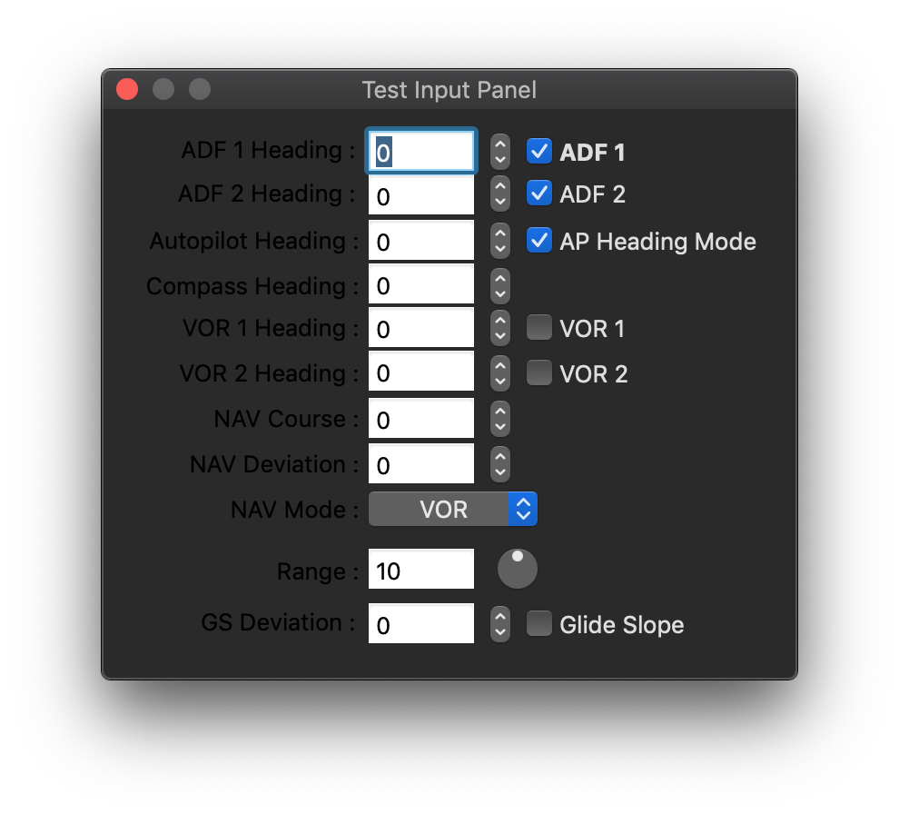

#AirbusND -- Airbus Navigation Display / Simulator
This code simulates the output of an Airbus A320 navigation display.
##Introduction

I originally wrote this code while on vacation in Hawaii. Besides enjoying the sun and the beach I also wanted spend some time working on something related to my hobby, which is flight simulation. In any case, I had some images of an Airbus 320 navigation display. I though it would be cool to hookup X-Plane 9 to an external iPad or Mac controlled display and see a closeup of some of the instrumentation.

The code in the `ObjectiveC` directory is a direct result of those efforts. Originally, the compass-rose displayed text at 30 degree increments around the circumference but Apple has since deprecated the API's I used to make that happen. Here is what the app looks like if you run it in macOS 10.14:

As it is currently written the compass-rose and the networking code that reads in and interprets UDP packets from X-plane are both broken. I have no plans to go back and fix these features. Actually in the case of the networking code, I'm not sure I finished getting that working as my whole team was laid-off in December '08, immediately after I returned from my vacation.

The drawing code was crafted using the mark-one eyeball. I would literally look at the images put some numbers into the drawing formula for each element of the display, then run it in order to see if I could match the output of the original instrumentation images. Not the best way to craft a drawing algorithm but when you don't have any specification or models except for a 2D image, you make do.

Some years, later, I ported the Objective-C implementation to Swift version 3. Actually, I'm not totally sure of that as Swift changes so quickly. Now that Swift 5 has been released and version 5.1 is on the way, I think it is time to finish this project and put it on iOS. I can use an old iPad as a display for my cockpit. I don't need to wire up a clunky monitor.

As you probably inferred from the timeline leading up to this point, this is a side project. I'm so busy trying to make a living and run a business that I don't have a lot of time or leftover energy to spend on it. As I make progress, I'll update the README.
## Swift Implementation
I now have a Swift implementation that I plan to augment over time. The current version runs on iOS 12 on both the iPad and the iPhone. It displays only in profile mode and has only a few controls to run a _built-in display test_ (bit), change the range in nautical miles (meaningless until I add code to display nav-aids), switch between different ADF and VOR types for channels 1 and 2, and to switch between master navigation modes including ILS, VOR, and OFF (none).

Having ported this code over from Objective-C without refactoring for Swift features, the code is pretty routine. I hope to get some time to analyze the implementation and perhaps implement a more protocol-oriented approach that will make testing and adding more features easier. Currently the app is very visual and doesn't have much logic for anything but drawing and taking input from a few buttons. As features are added, the need and opportunity for writing meaningful unit-tests will multiply.

In the original Objective-C implementation I make use of bindings in order to implement the test-panel.

I briefly considered using KVO with modern Swift syntax as a replacement but I don't think I like the dependencies on the Objective-C runtime that come with this facility. I'm currently considering alternatives. Ultimately, I need to have the view driven by changes to the model. I also need to model to be updated by controls in the UI as well as asynchronous inputs from the network (flight simulation).

## Desired Features
- [ ] Add remaining controls for all existing graphics display features.
   - [ ] Autopilot heading bug on/off
   - [ ] Autopilot heading selection
   - [ ] Nav course selection
   - [ ] Nav course deviation
   - [ ] Glide slope display on/off
   - [ ] Glide slope deviation
- [ ] Implement landscaped views (use size classes) for both the iPhone and iPad.
- [ ] Networking support for X-Plane
- [ ] Networking support for DCS (maybe, need to research how this is done on DCS).